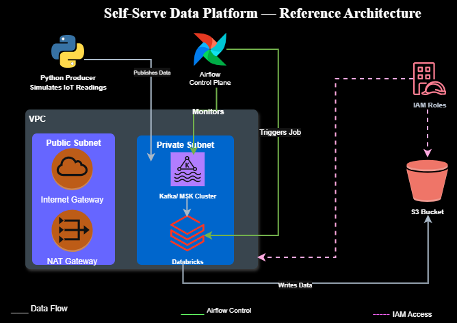
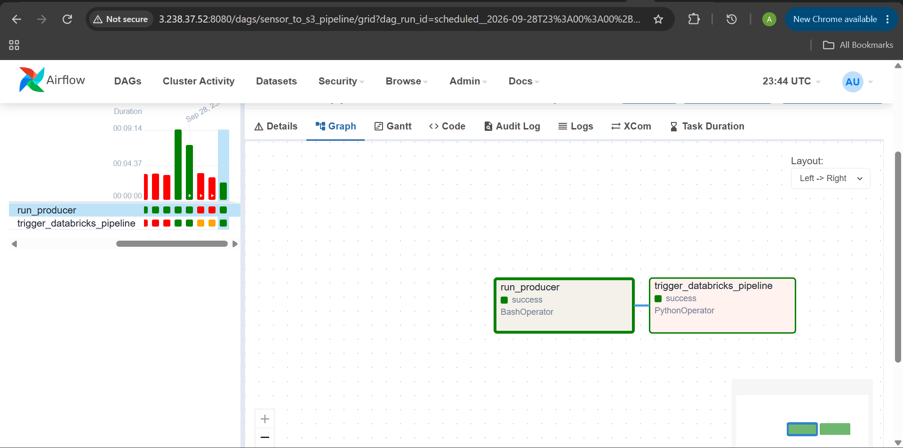
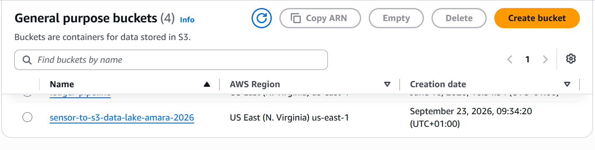
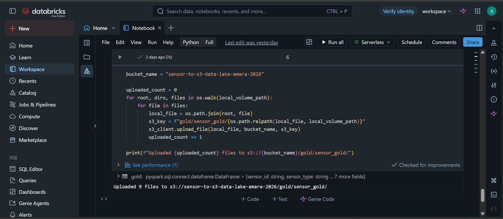

# Sensor to S3 — Self-Serve Data Platform Bootstrap

A self-hosted, Terraform-provisioned data platform: simulated IoT sensor data streams through Kafka, gets transformed through a Bronze → Silver → Gold pipeline on Databricks, lands in S3, and the whole thing is orchestrated on a schedule by Airflow.

This isn't a managed-service tutorial. Every piece of infrastructure — the VPC, the Kafka broker, the Airflow instance — is self-hosted on AWS EC2 and defined as code. The point of the project is proving I can stand up and operate a data platform from scratch, not just configure someone else's.



## Architecture

```
Python Producer → Kafka (self-hosted, KRaft mode) → Databricks (Bronze/Silver/Gold) → S3
                                                              ↑
                                                          Airflow
                              (runs the producer, then submits a one-time notebook run
                                   via the Databricks Jobs API)
```

- **VPC** — public + private subnets, NAT Gateway, route tables, security groups
- **Kafka** — self-hosted on EC2 in KRaft mode (no ZooKeeper), not managed MSK — chosen deliberately to prove infrastructure ownership rather than just configuring a managed service
- **Producer** — Python script simulating IoT sensor readings (temperature, humidity, vibration), with ~10% deliberately injected messiness: out-of-range values, missing fields, nulls, duplicate timestamps
- **Databricks** — Bronze (raw), Silver (cleaned/deduplicated/validated), Gold (windowed aggregates) Delta tables
- **S3** — final Gold-layer storage, written via boto3 (Databricks Free Edition's serverless compute blocks direct Spark-to-S3 config, so this bridges that gap)
- **Airflow** — self-hosted via Docker Compose on EC2, Terraform-provisioned; on a schedule it runs the producer, then submits a one-time notebook run to Databricks via the Jobs API (`runs/submit`, not a saved Job resource)

## Tech stack

Terraform · AWS (EC2, VPC, S3, IAM) · Apache Kafka (KRaft) · Apache Airflow · Databricks (Free Edition) · Python · Docker Compose

## Why these choices

**Self-hosted Kafka over MSK** — MSK proves you can configure AWS's managed offering. Self-hosting proves you understand broker configuration, KRaft coordination, and network setup underneath it — and it produces real failure modes worth debugging and documenting (see below).

**Plain PySpark over Delta Live Tables** — DLT abstracts away the Bronze/Silver/Gold mechanics this project is meant to demonstrate. Manual transforms plus Airflow orchestration show the underlying skill rather than configuring a managed pipeline tool.

**Airflow calling Databricks via raw REST API, not the official provider package** — the `apache-airflow-providers-databricks` package pulled in an incompatible Airflow 3.x core as a transitive dependency, breaking the running instance. Rather than fight the dependency tree, the DAG calls Databricks' Jobs API directly with `requests`, which ships with Airflow already. Fewer dependencies, same result.

## What actually broke (and the real fixes)

This project surfaced a genuine set of infrastructure debugging problems — documenting them here because the debugging is as much the point as the final green checkmark.

| Problem | Root cause | Fix |
|---|---|---|
| Kafka `KafkaTimeoutError` on every producer connection | `advertised.listeners` was empty — the install script's IMDSv2 metadata call ran before networking was ready | Fetch the public IP via the IMDSv2 token endpoint explicitly, patch `server.properties` with it |
| Kafka OOM crash on boot | Default JVM heap (1GB) exceeded `t3.micro`'s total RAM | Set `KAFKA_HEAP_OPTS="-Xmx400m -Xms400m"` |
| `terraform apply` silently rebuilding the Kafka instance | AMI lookup used `most_recent = true`, so any new AWS image published mid-project forced a replacement | Pinned the AMI ID as a fixed variable |
| Airflow webserver stuck in an OOM crash loop | 4 default gunicorn workers exceeded available memory alongside Postgres + scheduler | Reduced to 2 workers via `AIRFLOW__WEBSERVER__WORKERS` |
| `pip install apache-airflow-providers-databricks` broke the whole container | The package's dependency resolution pulled in Airflow 3.x, uninstalling the working 2.9.3 core | Dropped the provider package entirely; call the Databricks REST API directly with `requests` |
| `ModuleNotFoundError: No module named 'kafka'` inside Airflow tasks | Host-level `pip install` doesn't reach into the Airflow Docker container's isolated environment | Installed via `_PIP_ADDITIONAL_REQUIREMENTS` in `docker-compose.yaml` so it persists across container restarts |
| Databricks Jobs API returning `400 Bad Request` | Free Edition workspace is serverless-only; the payload specified a `new_cluster` | Removed cluster specification entirely and switched to the `tasks` array format Free Edition requires |
| Recurring "connection timed out" across SSH, Kafka, and Airflow UI | Home ISP assigns a rotating dynamic IP; security group rules were scoped to a single IP | Documented as a known limitation; addressed by widening debug rules during active development and tightening them afterward |

## It runs

**Airflow orchestrating the pipeline end-to-end:**



**Gold-layer data landing in S3:**



**The Databricks notebook run, submitted via the Jobs API:**



## Project structure

```
terraform/
├── main.tf
├── modules/
│   ├── networking/    # VPC, subnets, NAT, route tables, security groups
│   ├── kafka/         # EC2 instance, KRaft install script, IAM/SSM role
│   ├── airflow/       # EC2 instance, Docker Compose install script
│   └── s3/            # Data lake bucket, IAM user scoped to that bucket only
producer/
├── sensor_producer.py # Simulated IoT sensor data generator
```

## Setup

1. `terraform init && terraform plan` from `terraform/`
2. `terraform apply` — provisions VPC, Kafka, Airflow, S3
3. SSH into the Kafka instance, confirm the broker started (`ps aux | grep kafka`)
4. Point `sensor_producer.py`'s `KAFKA_BROKER` at the Kafka instance's current address
5. In Databricks, run the Bronze/Silver/Gold notebook once manually to confirm the transforms
6. Access the Airflow UI on port 8080, unpause `sensor_to_s3_pipeline`, trigger a run

## Known limitations

- Databricks Free Edition's serverless-only compute means job configuration is more constrained than full Databricks-on-AWS
- Kafka and Airflow's EC2 instances get new public IPs on rebuild; production use would call for an Elastic IP or a proper bastion/VPN setup instead of per-session security group patches
- The producer runs in fixed 60-second bursts per Airflow trigger rather than continuously — a deliberate fit for Airflow's batch-scheduling model rather than a limitation

## Part of the Sensor to S3 build series

This project is documented as a build-in-public series — architecture decisions, debugging sessions, and the actual dead ends included.